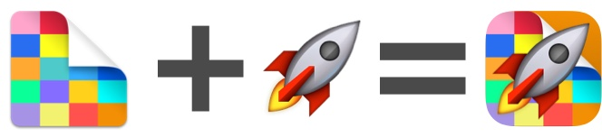

# DeckRocket

## DeckRocket turns your iPhone into a remote for [Deckset](http://decksetapp.com) presentations

## Requirements

DeckRocket is built in Swift and relies on Multipeer Connectivity on both OSX and iOS. Therefore beta versions of Xcode 6 (Beta 6), OSX 10.10 and iOS 8 are all required to build, install and use DeckRocket.

## Usage

1. Make sure you have the requirements listed above and that Deckset is running (with your presentation as the current document).
2. Open and run both `OSX/DeckRocket.xcodeproj` and `iOS/DeckRocket.xcodeproj`. You should see a :rocket: icon in your menu bar.
3. Export your Deckset presentation as a PDF.
4. Drag the your PDF onto the :rocket: icon in your Mac's menu bar. The file should start transferring to your iOS device instantly.

A connection should be established between the OSX and iOS apps within 10 seconds. You'll then be able to swipe through your slides and see Deckset navigate to them fairly instantly.

The magic of Multipeer Connectivity should allow this to work even if devices have no Internet connectivity and aren't even on the same WiFi network. But they must both have either Bluetooth or WiFi turned on.

## Troubleshooting

Since there are a number of pre-release technologies at play here, things will fail. So install and use at your own risk. Most notably, the multipeer connection is often lost. Tapping the screen about every 5 seconds when it says "Not Connected" usually resolves the issue after a few taps.

## License

This project is MIT licensed and was developed independently from Deckset and Unsigned Integer (but those guys are great!).
